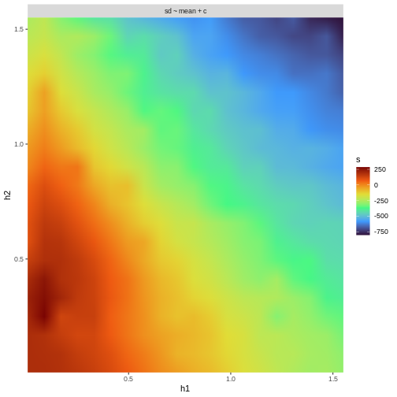

# 1. Setup
First we load `mavis` and then we use the `yeast_prog` dataset and to perform normalization and imputation. In addition, we will setup the model dependent variables we need.

```r
library(mavis)
# Setup design matrix
yeast_design <- model.matrix(~ 0 + factor(rep(1:2, each = 3)))
colnames(yeast_design) <- paste0("ng", c(50, 100))

# Normalize data
yeast <- yeast %>% 
  psrn('identifier')

# Compare the first and second column of the design matrix
# with the following contrast matrix
yeast_contrast <- matrix(c(-1, 1), ncol = 1)
```
Importantly, note that the column names of the design matrix are unique subsets of the names of the columns within the conditions:

```r
colnames(yeast)
#> [1] "identifier" "ng50_1"     "ng50_2"     "ng50_3"     "ng100_1"    "ng100_2"    "ng100_3"
colnames(yeast_design)
#> [1] "ng50"  "ng100"
```
This is essential for `mavis` to know which columns to use in calculations and to perform transformations on.

Sidenote: other datasets can be downloaded from figshare (link will be added on publication).

# 2. Mixture separation, prior estimation, and uncertainty estimation
The first step is to add the mean-variance trends to our data matrix:

```r
yeast <- yeast %>% 
  calculate_mean_sd_trends(yeast_design)
```
Next we perform imputation:

```r
yeast_imp <- yeast %>% 
  single_imputation(yeast_design)
#> Estimating Imputation Paramters
#> Previous error: Inf 	>	Current error: 5.552098 
#> Iteration time:
#>  5.251592 secs 
#> 
#> Previous error: 5.552098 	>	Current error: 0.1110211 
#> Iteration time:
#>  5.211464 secs 
#> 
#> Previous error: 0.1110211 	>	Current error: 0.0459913 
#> Iteration time:
#>  5.172839 secs 
#> 
#> Previous error: 0.0459913 	>	Current error: 0.02246914 
#> Iteration time:
#>  5.233124 secs 
#> 
#> Previous error: 0.02246914 	>	Current error: 0.01732135 
#> Iteration time:
#>  5.453339 secs 
#> 
#> Previous error: 0.01732135 	>	Current error: 0.01273238 
#> Iteration time:
#>  6.629436 secs 
#> 
#> Previous error: 0.01273238 	>	Current error: 0.01055465 
#> Iteration time:
#>  6.708434 secs 
#> 
#> Previous error: 0.01055465 	>	Current error: 0.01033649 
#> Iteration time:
#>  6.94471 secs 
#> 
#> Previous error: 0.01033649 	>	Current error: 0.008182787 
#> Iteration time:
#>  6.844452 secs 
#> 
#> Previous error: 0.008182787 	>	Current error: 0.006065938 
#> Iteration time:
#>  7.293429 secs 
#> 
#> Previous error: 0.006065938 	>	Current error: 0.006002696 
#> Iteration time:
#>  5.672156 secs 
#> 
#> Previous error: 0.006002696 	>	Current error: 0.005474073 
#> Iteration time:
#>  5.162628 secs 
#> 
#> Previous error: 0.005474073 	<	Current error: 0.007831938 	Breaking 
#> Iteration time:
#>  5.175086 secs
```
After imputation we re-estimate the mean-variance trends and partition the data:

```r
yeast_grid <- yeast_imp %>% 
  calculate_mean_sd_trends(yeast_design) %>% 
  grid_search(yeast_design, n_h1 = 20, n_h2 = 20, workers = round(parallel::detectCores()/2))
#> 
#> Attaching package: 'purrr'
#> The following object is masked from 'package:magrittr':
#> 
#>     set_names
#> 
#> Attaching package: 'dplyr'
#> The following objects are masked from 'package:stats':
#> 
#>     filter, lag
#> The following objects are masked from 'package:base':
#> 
#>     intersect, setdiff, setequal, union
```



```r
yeast_grid
#> # A tibble: 400 × 5
#>         h1      h2 formula       s clustered_data       
#>      <dbl>   <dbl> <list>    <dbl> <list>               
#>  1 0.0875  0.250   <formula>  282. <tibble [2,235 × 11]>
#>  2 0.0875  0.331   <formula>  265. <tibble [2,235 × 11]>
#>  3 0.0875  0.413   <formula>  230. <tibble [2,235 × 11]>
#>  4 0.00620 0.250   <formula>  229. <tibble [2,235 × 11]>
#>  5 0.169   0.250   <formula>  229. <tibble [2,235 × 11]>
#>  6 0.00620 0.331   <formula>  228. <tibble [2,235 × 11]>
#>  7 0.169   0.331   <formula>  219. <tibble [2,235 × 11]>
#>  8 0.00620 0.413   <formula>  208. <tibble [2,235 × 11]>
#>  9 0.00620 0.00620 <formula>  198. <tibble [2,235 × 11]>
#> 10 0.00620 0.0875  <formula>  198. <tibble [2,235 × 11]>
#> # ℹ 390 more rows
# Select the dataset with the largest score
yeast_cluster <- yeast_grid$clustered_data[[1]]
```
Then we fit the gamma regression model:

```r
gam_clust_reg <- yeast_cluster %>% 
  fit_gamma_regression(sd ~ mean + c)
```
Finally, we estimate the uncertainties needed for `baldur`:

```r
# Get each data points uncertainty
yeast_unc <- yeast_cluster %>% 
  estimate_uncertainty('identifier', design_matrix = yeast_design, gam_clust_reg)
```
# 3. Run the sampling procedure
Side note: I highly recommend running `baldur` with the parallel implementation in next section due to the massive speed up.
Finally we sample the posterior of each row in the data as follows:

```r
yeast_results <- gam_clust_reg %>% 
  # Estimate gamma priors
  estimate_gamma_hyperparameters(yeast_cluster, design_matrix = yeast_design) %>% 
  # For time purposes we only sample for six rows
  head() %>% 
  infer_data_and_decision_model(
    'identifier',
    yeast_design,
    yeast_contrast,
    yeast_unc
  )
# The top hits then looks as follows:
yeast_results %>% 
  dplyr::arrange(err)
#> # A tibble: 6 × 22
#>   identifier   comparison    err     lfc lfc_025  lfc_50 lfc_975 lfc_eff lfc_rhat sigma sigma_025 sigma_50 sigma_975 sigma_eff sigma_rhat     lp
#>   <chr>        <chr>       <dbl>   <dbl>   <dbl>   <dbl>   <dbl>   <dbl>    <dbl> <dbl>     <dbl>    <dbl>     <dbl>     <dbl>      <dbl>  <dbl>
#> 1 Cre01.g0008… ng100 vs … 0.0877 -0.241   -0.520 -0.239   0.0302   4769.    0.999 0.139    0.0906    0.134     0.215     2529.      1.00    3.97
#> 2 Cre01.g0045… ng100 vs … 0.0893 -0.279   -0.601 -0.277   0.0432   5594.    0.999 0.163    0.120     0.160     0.221     4638.      1.00   -4.57
#> 3 Cre01.g0045… ng100 vs … 0.292  -0.261   -0.760 -0.263   0.230    5387.    1.00  0.245    0.191     0.243     0.313     4933.      1.00  -16.6 
#> 4 Cre01.g0023… ng100 vs … 0.387   0.293   -0.387  0.295   0.966    6081.    0.999 0.340    0.271     0.337     0.426     4689.      1.00  -23.2 
#> 5 Cre01.g0023… ng100 vs … 0.738   0.167   -0.780  0.158   1.17     5735.    0.999 0.471    0.367     0.466     0.602     5208.      0.999 -21.7 
#> 6 Cre01.g0043… ng100 vs … 0.962   0.0248  -1.00   0.0150  1.06     5905.    0.999 0.497    0.391     0.492     0.632     4326.      1.00  -24.3 
#> # ℹ 6 more variables: lp_025 <dbl>, lp_50 <dbl>, lp_975 <dbl>, lp_eff <dbl>, lp_rhat <dbl>, warnings <list>
```
Here `err` is the probability of error, i.e., the tail-density supporting the null-hypothesis, `lfc` is the estimated log$_2$-fold change, and `sigma` is the common variance.
Columns without suffix shows the mean estimate from the posterior, while the suffixes `_025`, `_975`, and `_med` are the 2.5, 97.5, and 50.0 percentiles, respectively.
The suffixes `_eff` and `_rhat` and the prefix `lp__` are the diagnostic variables returned by `rstan` (please see the Stan manual for details).

# 4. Sampling with parallel computation
As of now, Rstan models compiled with a package cannot be ran in parallel using the `multidplyr` backend.
Therefore, we first need to compile the model, and then we can use the compiled model to run parallel computation:

```r
yeast_results <- gam_clust_reg %>% 
  # Estimate gamma priors
  estimate_gamma_hyperparameters(yeast_cluster, design_matrix = yeast_design) %>% 
  # For time purposes we only sample for 20 rows
  head(20) %>% 
  infer_data_and_decision_model(
    'identifier',
    yeast_design,
    yeast_contrast,
    yeast_unc,
    clusters =  2
  )
```
