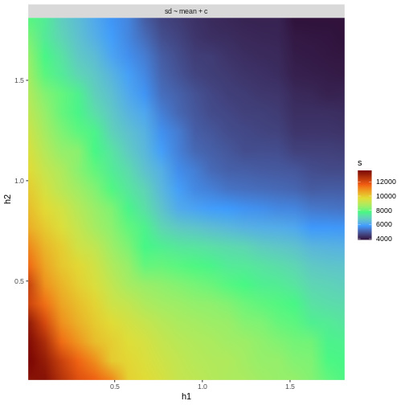
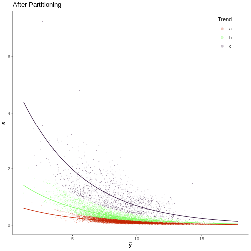
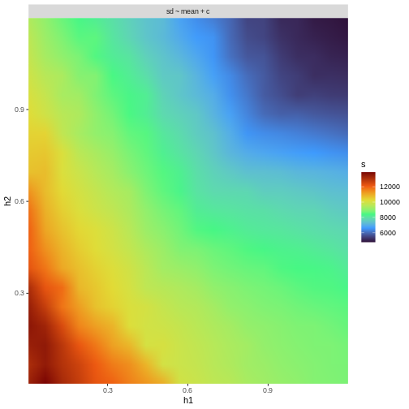

Here we will exemplify how to run the ensemble method using the UPS-DS.

```r
# Load Mavis
library(mavis)

# Setup helper function to run Baldur
baldur_wrapper <- function(data, design, contrast, gam_model, mean_prior = empirical_bayes, workers) {
  uncertainty <- data %>%
    mavis::estimate_uncertainty('identifier', design, gam_model)
  gam_model %>%
    mavis::estimate_gamma_hyperparameters(data, design) %>%
    baldur::infer_data_and_decision_model(
      id_col = 'identifier',
      design_matrix = design,
      contrast_matrix = contrast,
      uncertainty_matrix = uncertainty,
      stan_model = mean_prior,
      clusters = workers
    )
}

# Setup input variables
workers <- round(parallel::detectCores()/2)
ups_design <- model.matrix(~ 0 + factor(rep(1:3, each = 4)))
colnames(ups_design) <- paste0("fmol", c(25, 50, 100))
ups_cont <- combn(colnames(ups_design), 2, FUN = \(x) paste0(x, collapse = "-")) %>%
  limma::makeContrasts(contrasts = ., levels = ups_design)

# Normalize data
ups_norm <- ups %>%
  psrn("identifier")
```
Since we will be doing imputation for Baldur and each time we run limma; we first infer the imputation paramters.


```r
ups_imp_pars <- get_imputation_pars(ups_norm, ups_design, sd_p ~ mean, workers)
#> Estimating Imputation Paramters
#> Previous error: Inf 	>	Current error: 8.695114 
#> Iteration time:
#>  28.07736 secs 
#> 
#> Previous error: 8.695114 	>	Current error: 0.08210912 
#> Iteration time:
#>  28.67895 secs 
#> 
#> Previous error: 0.08210912 	>	Current error: 0.02492085 
#> Iteration time:
#>  28.36011 secs 
#> 
#> Previous error: 0.02492085 	>	Current error: 0.01484044 
#> Iteration time:
#>  28.65222 secs 
#> 
#> Previous error: 0.01484044 	>	Current error: 0.006348059 
#> Iteration time:
#>  28.70778 secs 
#> 
#> Previous error: 0.006348059 	>	Current error: 0.005851834 
#> Iteration time:
#>  28.70757 secs 
#> 
#> Previous error: 0.005851834 	>	Current error: 0.004621849 
#> Iteration time:
#>  28.76481 secs 
#> 
#> Previous error: 0.004621849 	>	Current error: 0.003686415 
#> Iteration time:
#>  28.75814 secs 
#> 
#> Previous error: 0.003686415 	<	Current error: 0.003692812 	Breaking 
#> Iteration time:
#>  28.75608 secs
```

First we will run the limma based models.
To this end, we will first estimate the trend partitioing for the data.


```r
ups_grid <- ups_norm %>%
  calculate_mean_sd_trends(ups_design, sdev = "sample") %>%
  grid_search(ups_design, workers = workers, n_h1 = 20, n_h2 = 20)
```



```r
# Look at the top parameters
ups_grid
#> # A tibble: 400 × 5
#>         h1      h2 formula        s clustered_data          
#>      <dbl>   <dbl> <list>     <dbl> <list>                  
#>  1 0.00724 0.102   <formula> 13587. <spc_tbl_ [10,599 × 16]>
#>  2 0.00724 0.197   <formula> 13468. <spc_tbl_ [10,599 × 16]>
#>  3 0.102   0.00724 <formula> 13381. <spc_tbl_ [10,599 × 16]>
#>  4 0.00724 0.00724 <formula> 13334. <spc_tbl_ [10,599 × 16]>
#>  5 0.00724 0.292   <formula> 13197. <spc_tbl_ [10,599 × 16]>
#>  6 0.102   0.102   <formula> 13112. <spc_tbl_ [10,599 × 16]>
#>  7 0.102   0.197   <formula> 12727. <spc_tbl_ [10,599 × 16]>
#>  8 0.197   0.00724 <formula> 12601. <spc_tbl_ [10,599 × 16]>
#>  9 0.00724 0.482   <formula> 12303. <spc_tbl_ [10,599 × 16]>
#> 10 0.197   0.102   <formula> 12260. <spc_tbl_ [10,599 × 16]>
#> # ℹ 390 more rows
```
We can then extract the dataset with the highest score.

```r
ups_part <- ups_grid$clustered_data[[1]]
rm(ups_grid)
ups_part %>%
  plot_gamma_partition(ups_design, formula = sd ~ mean + c)
```



Next we run the multiple imputation and produce the median log$_2$-fold change and p-value which we will use in the ensemble.

```r
limma_trend <- multiple_imputation_and_limma(ups_part, ups_design, ups_cont,
                                             1000, workers, "identifier",
                                             imp_pars = ups_imp_pars
) %>%
  extract_results(alpha = .05, pcor = "fdr", id_col = "identifier")
limma_gr <- multiple_imputation_and_limma(ups_part, ups_design, ups_cont,
                                          1000, workers, "identifier",
                                          imp_pars = ups_imp_pars,
                                          weights = TRUE,
                                          formula_weights = sd ~ mean
) %>%
  extract_results(alpha = .05, pcor = "fdr", id_col = "identifier")
limma_gcr <- multiple_imputation_and_limma(ups_part, ups_design, ups_cont,
                                           1000, workers, "identifier",
                                           imp_pars = ups_imp_pars,
                                           weights = TRUE,
                                           formula_weights = sd ~ mean + c
) %>%
  extract_results(alpha = .05, pcor = "fdr", id_col = "identifier")
```
Next we want to run the Baldur methods and to make it even we will also use the weakly informative prior so we get three of each method type.
But first we have to do the imputation and then multi trend partitioning.


```r
ups_imp   <- single_imputation(ups_norm,
                               ups_design,
                               formula = sd_p ~ mean,
                               workers = workers,
                               imp_pars = ups_imp_pars
) %>%
  calculate_mean_sd_trends(ups_design)
ups_imp_part <- grid_search(ups_imp,
                            ups_design,
                            workers = workers,
                            n_h1 = 20, n_h2 = 20
) %>%
  # Get the data column
  magrittr::use_series(clustered_data) %>%
  # Get the first instance (i.e., highest score)
  magrittr::extract2(1)
```



```r
gr_ups       <- fit_gamma_regression(ups_imp)
gcr_ups      <- fit_gamma_regression(ups_imp_part, sd ~ mean + c)
gr_baldur    <- baldur_wrapper(ups_imp,
                             ups_design,
                             ups_cont,
                             gr_ups,
                             workers = workers
)
gcr_baldur <- baldur_wrapper(ups_imp_part,
                             ups_design,
                             ups_cont,
                             gcr_ups,
                             workers = workers
)
gcr_wi_baldur <- baldur_wrapper(ups_imp_part,
                             ups_design,
                             ups_cont,
                             gcr_ups,
                             mean_prior = weakly_informative,
                             workers = workers
)
```
Now we can start adding the methods to the ensemble.
`mavis` ensemble object is very similar to a data stack structure.
In addition, we will strip the results of each method down to the essential columns and remove them from our global environment to save up on memory.

```r
# Start a new instance of the ensemble
ups_ens <- start_ensemble()
ups_ens$add(
  limma_trend, "limma-trend", "identifier", "median_p_val", "median_lfc",
  auxilary = "none", do_rm = TRUE
)$add(
  limma_gr, "gr-limma", "identifier", "median_p_val", "median_lfc",
  auxilary = "none", do_rm = TRUE
)$add(
  limma_gcr, "gcr-limma", "identifier", "median_p_val", "median_lfc",
  auxilary = "none", do_rm = TRUE
)$add(
  gr_baldur, "gr-balur", "identifier", "err", "lfc",
  auxilary = "none", do_rm = TRUE
)$add(
  gcr_baldur, "gcr-balur", "identifier", "err", "lfc",
  auxilary = "none", do_rm = TRUE
)$add(
  gcr_wi_baldur, "gcr-balur-wi", "identifier", "err", "lfc",
  auxilary = "none", do_rm = TRUE
)
# Available methods
ups_ens
#> Ensemble Stack of 6
#> Methods Available: limma-trend, gr-limma, gcr-limma, gr-balur, gcr-balur, gcr-balur-wi
```
Then we can run the ensemble with `$run_ensemble`.
Since I have 8 cores if I use half of the available once, I will add one more to make it nine.

```r
workers
#> [1] 8
workers <- workers + 1
```
For the UPS-DS (as defined here) there are three comparisons, we could run two parallel instances each with 4 parallel chains (eight total in parellel) to speed up the process.
But since I decided to use nine  cores, I can run three chains on three parallel instances so that all comparisons can be ran at the same time.

```r
ups_ens_results <- ups_ens$run_ensemble(parallel_chains = 3,
                                        parallel_runs = 3,
                                        # Additional arguments to rstan::sample
                                        # to adjust for running one chain less
                                        chains = 3, iter = 2400, warmup = 1000
)
ups_ens_results
#> # A tibble: 31,797 × 5
#>    identifier                                                  comparison        p_val n_eff  Rhat
#>    <chr>                                                       <chr>             <dbl> <dbl> <dbl>
#>  1 Cre01.g000350.t1.1|PACid:30788481|--AVLLFATGSGISPLR         fmol25 vs fmol100 0.700 2064.  1.00
#>  2 Cre01.g000350.t1.1|PACid:30788481|--AVLLFATGSGISPLR         fmol25 vs fmol100 0.820 2020.  1.00
#>  3 Cre01.g000350.t1.1|PACid:30788481|--AVLLFATGSGISPLR         fmol25 vs fmol100 0.920 2312.  1.00
#>  4 Cre01.g000350.t1.1|PACid:30788481|--GFALDRLPASTTR           fmol25 vs fmol100 0.623 2330.  1.00
#>  5 Cre01.g000350.t1.1|PACid:30788481|--GFALDRLPASTTR           fmol25 vs fmol100 0.590 1818.  1.00
#>  6 Cre01.g000350.t1.1|PACid:30788481|--GFALDRLPASTTR           fmol25 vs fmol100 0.966 2384.  1.00
#>  7 Cre01.g000350.t1.1|PACid:30788481|--VVIDVGAPLAAGYTVPGQFVQVK fmol25 vs fmol100 0.886 1524.  1.00
#>  8 Cre01.g000350.t1.1|PACid:30788481|--VVIDVGAPLAAGYTVPGQFVQVK fmol25 vs fmol100 0.623 2112.  1.00
#>  9 Cre01.g000350.t1.1|PACid:30788481|--VVIDVGAPLAAGYTVPGQFVQVK fmol25 vs fmol100 0.764 2686.  1.00
#> 10 Cre01.g000350.t1.1|PACid:30788481|--VVSVYSESK               fmol25 vs fmol100 0.720 1832.  1.00
#> # ℹ 31,787 more rows
```
By default all the methods in the the stack will be ran but we can specify which methods to run with the `methods` argument.
But, we could either `$pop` out methods back to our global environment, or we could define a subset of methods to run.
Finally, we could run three parallel chains on three parallel instances instead of four and two so that all three comparisons can be ran at the same time.

```r
# Run a limma specific ensemble
ups_limma_ens_results <- ups_ens$run_ensemble(methods = 1:3,
                                              parallel_chains = 3,
                                              parallel_runs = 3,
                                              chains = 3, iter = 2400, warmup = 1000
)
# Alternatively to 1:3 we could have called the methods by name
# method = c("limma-trend", paste0(c("gr", "gcr"), "-limma"))
# Running Baldur specific methods by first removing the limma ones
ups_ens$pop(
  1:3
)
#> Warning: Unknown or uninitialised column: `pop`.
#> Error in eval(expr, envir, enclos): attempt to apply non-function
ups_baldur_ens_results <- ups_ens$run_ensemble(parallel_chains = 3,
                                               parallel_runs = 3,
                                               chains = 3,
                                               iter = 2400, warmup = 1000
)
```
