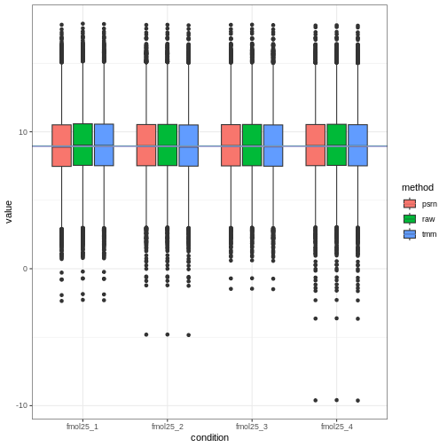
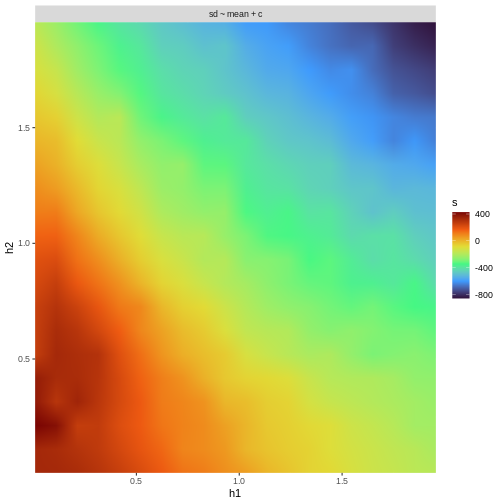
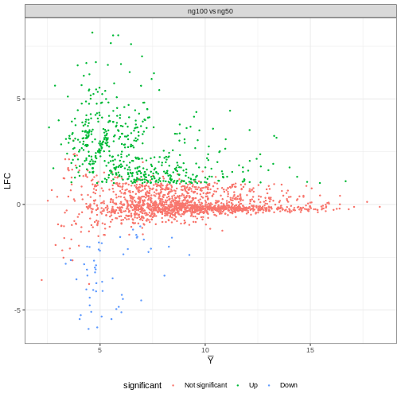

First we load the package:

```r
library(mavis)
```
## Datasets included in `mavis`
`mavis` comes with two of the published data sets, `yeast` and `ups`, published in @berg2019evaluation (details can be found there; please cite accordingly if you use these data in your work).
Both datasets are quantified with Progenesis.
The `ups` data sets is a global proteomics dataset without reducing peptides to proteins with either *Chlamydomonas reinhardtii* (chlamy) peptides with the same concentration in all samples.
The `ups` is spiked-in with three different concentrations of the Universal Proteomics Standard Set 1 (UPS1) with four replicates each.
The `yeast` data was generated by extracting reversibly oxidized cysteines in *Saccharomyces cerevisiae* or chlamy where the yeast extraction was added in two different concentrations and chlamy in the same in all samples.
The `yeast` data is therefore a lot noisier than the `ups` data.
The yeast data looks as follows:

```r
yeast
#> # A tibble: 2,235 × 7
#>    identifier                               ng50_1 ng50_2 ng50_3 ng100_1 ng100_2 ng100_3
#>    <chr>                                     <dbl>  <dbl>  <dbl>   <dbl>   <dbl>   <dbl>
#>  1 Cre01.g000450.t1.2|PACid:30788617|--321   77.4    78.1   76.4    11.3    5.99    NA  
#>  2 Cre01.g000800.t1.2|PACid:30788536|--66   247.    255.   245.    225.   227.     231. 
#>  3 Cre01.g002050.t1.1|PACid:30789101|--408   60.1    43.2   69.9   133.   113.     118. 
#>  4 Cre01.g002300.t1.2|PACid:30788660|--168   90.8    74.9   55.1    96.8   90.1     76.7
#>  5 Cre01.g002300.t1.2|PACid:30788660|--40   932.   1096.   925.   1179.  1377.    1335. 
#>  6 Cre01.g002300.t1.2|PACid:30788660|--69   537.    469.   369.   1106.  1127.    1099. 
#>  7 Cre01.g004350.t1.2|PACid:30788641|--148   90.6   110.    70.6   119.    94.5     81.0
#>  8 Cre01.g004500.t1.2|PACid:30789545|--270    3.56   NA     NA      99.0  111.      81.0
#>  9 Cre01.g004500.t1.2|PACid:30789545|--355 4376.   4311.  3952.   3901.  3643.    3697. 
#> 10 Cre01.g004500.t1.2|PACid:30789545|--402  271.    123.    32.0   787.   799.     785. 
#> # ℹ 2,225 more rows
```
where the `identifier` is a column that uniquely maps each cysteine to the observations in `ng50_*` or `ng100_*` (which are the relative concentrations the yeast cysteines were spiked in with) and the integer at the end indicates different repeated experiments.
The ups data looks as follows:

```r
ups
#> # A tibble: 10,599 × 13
#>    identifier                    fmol25_1 fmol25_2 fmol25_3 fmol25_4 fmol50_1 fmol50_2 fmol50_3 fmol50_4 fmol100_1 fmol100_2 fmol100_3 fmol100_4
#>    <chr>                            <dbl>    <dbl>    <dbl>    <dbl>    <dbl>    <dbl>    <dbl>    <dbl>     <dbl>     <dbl>     <dbl>     <dbl>
#>  1 Cre01.g000350.t1.1|PACid:307…   695.     674.      689.     694.     741.     739.     733.     796.      644.      675.      715.      735. 
#>  2 Cre01.g000350.t1.1|PACid:307…   736.     636.      657.     608.     793.     783.     694.     734.      654.      642.      619.      613. 
#>  3 Cre01.g000350.t1.1|PACid:307…   681.     727.      638.     647.     732.     726.     654.     661.      628.      694.      607.      684. 
#>  4 Cre01.g000350.t1.1|PACid:307…   491.     448.      463.     444.     372.     408.     408.     475.      413.      389.      476.      433. 
#>  5 Cre01.g000900.t1.2|PACid:307…     7.90     1.19     NA       26.9     NA       33.4     NA       NA        NA        NA        NA        NA  
#>  6 Cre01.g000900.t1.2|PACid:307…   106.      82.6     102.      96.6     84.3     97.3     93.1     90.0      91.2      91.2      86.6     108. 
#>  7 Cre01.g000900.t1.2|PACid:307…    39.3     64.5      15.3     60.2     31.0     29.2     38.5     57.6      35.5      51.0      41.1      47.7
#>  8 Cre01.g001100.t1.2|PACid:307…   694.     664.      530.     453.     617.     566.     518.     275.      581.      513.      488.      449. 
#>  9 Cre01.g001100.t1.2|PACid:307…   525.     601.      673.     618.     631.     509.     669.     593.      530.      626.      635.      680. 
#> 10 Cre01.g001100.t1.2|PACid:307…   743.     671.      680.     636.     664.     667.     687.     649.      679.      624.      762.      689. 
#> # ℹ 10,589 more rows
```
where the `identifier` is as in the yeast dataset but uniquely maps peptides and `fmol25_*`, `fmol50_*`, and `fmol100_*` are different relative concentrations of UPS1 with different technical replicates.

## Data normalization
The first step is to normalize the data.
The function `plot_norm_box` generates boxplots of the raw data after log$_{2}$ transformation and two different normalization methods. If we first look at the yeast data, then the plot can be generated as follows:

```r
plot_norm_box(yeast, 'identifier')
```


The data is already has a stable median, but we still do normalization.
This can either be done `tmm` as introduced in @robinson2010scaling or with `psrn` as introduced in @anders2010differential.
To exemplify we use `psrn` and `tmm` as follows:

```r
yeast_psrn <- psrn(yeast, 'identifier')
yeast_tmm  <- tmm(yeast)
```
Both `psrn` and `tmm` first normalizes the data and then log$_{2}$ transforms it unless the flag `log=FALSE` is used.
For the `ups` data we do the same thing:

```r
plot_norm_box(ups, 'identifier')
```


we might notice that the x-axis labels are overlapping.
Since `plot_norm_box` returns a `ggplot` object, one can easily rotate the label by using the `+` syntax and `ggplot2::theme` as follows:

```r
plot_norm_box(ups, 'identifier') +
  ggplot2::theme(
    axis.text.x = ggplot2::element_text(angle = 15)
  )
```


in this way, any theme of the plot can easily be modified using `ggplot2` syntax.
One could also use the `plot_target` feature of `plot_norm_box` to select only a subset of samples to plot:

```r
plot_norm_box(ups, 'identifier', plot_target = contains('fmol25'))
```


which supports the `tidyselect` package operations for selecting columns.
Likewise, `tmm` and `psrn` have the flag `target` which can be used to select only a subset of columns to normalize.
If left unspecified they will use all numerical columns in the normalization!
They also contain the flag `load_info` which then makes the functions return a list with the normalized data, the estimated loading concentrations, and the estimated normalization factors used.
We then normalize the `ups` the same way as the `yeast`:

```r
ups_psrn <- psrn(ups, 'identifier')
ups_tmm <- tmm(ups)
```

## Gamma regression for imputation and mean-variance normalization
From here on out, several functions in `mavis` will depend on a design matrix.
A design matrix can be created as follows:

```r
yeast_design <- model.matrix(
  # Yeast has two conditions (1:2) and three replicates (each = 3)
  ~0+factor(rep(1:2, each = 3))
)
ups_design <- model.matrix(
  # ups has three conditions (1:3) and four replicates (each = 4)
  ~0+factor(rep(1:3, each = 4))
)
# The design matrices has to have the same name as the conditions:
colnames(yeast_design) <- paste0('ng',   c(50, 100))
colnames(ups_design)   <- paste0('fmol', c(25, 50, 100))
```
Next, we will calculate the M-V trend and determine the integration windows for the trend partitioning.

```r
yeast_grid <- yeast_psrn %>% 
  calculate_mean_sd_trends(yeast_design) %>% 
  grid_search(yeast_design, n_h1 = 20, n_h2 = 20, workers = round(parallel::detectCores()/2))
```



```r
yeast_grid
#> # A tibble: 400 × 5
#>         h1      h2 formula       s clustered_data         
#>      <dbl>   <dbl> <list>    <dbl> <list>                 
#>  1 0.00782 0.213   <formula>  426. <spc_tbl_ [2,235 × 11]>
#>  2 0.110   0.213   <formula>  397. <spc_tbl_ [2,235 × 11]>
#>  3 0.00782 0.315   <formula>  374. <spc_tbl_ [2,235 × 11]>
#>  4 0.00782 0.418   <formula>  365. <spc_tbl_ [2,235 × 11]>
#>  5 0.213   0.315   <formula>  341. <spc_tbl_ [2,235 × 11]>
#>  6 0.00782 0.00782 <formula>  332. <spc_tbl_ [2,235 × 11]>
#>  7 0.00782 0.110   <formula>  331. <spc_tbl_ [2,235 × 11]>
#>  8 0.110   0.00782 <formula>  330. <spc_tbl_ [2,235 × 11]>
#>  9 0.110   0.520   <formula>  328. <spc_tbl_ [2,235 × 11]>
#> 10 0.110   0.418   <formula>  322. <spc_tbl_ [2,235 × 11]>
#> # ℹ 390 more rows
# Select the best dataset
yeast_psrn <- yeast_grid$clustered_data[[1]]
```

The gamma regression and mean-variance scatter plots can then be produced by `plot_gamma_regression`.
`plot_gamma_regression` plots the trends used for precision weights (later fed to `limma`'s `lmFit` similar to `voom`) on the left and gamma regression after trend partitioning on right.
For `yeast`:

```r
plot_gamma_regression(yeast_psrn, yeast_design, formula = sd ~ mean + c)
```


The two individual plots can be generated similarly by calling `plot_gamma` or `plot_gamma_partition`.
If one wants to inspect the estimated models that can be done similarly with `fit_gamma_regression`.

## Data imputation and significance calling
### Multiple imputation
To perform multiple imputations and then run limma on each imputation can efficiently be performed by `multiple_imputation_and_limma`.
`multiple_imputation_and_limma` fits the needed gamma regressions and has a backend to `multidplyr` for parallel processing.
This can drastically increase the speed when running 1000 or more imputations.
Here is an example of the `yeast` data running 1000 imputations and using 5 parallel workers.
First, we need to generate a contrast matrix that indicates what comparisons to perform.

```r
yeast_contrast <- limma::makeContrasts(
  contrasts = 'ng100-ng50',
  levels = yeast_design
)
```
This performs the test if the mean of the cysteines in the `ng100` conditions is different from the means in the `ng50` condition.
Further, it also means that the LFC will be calculated as `ng100 - ng50`.
We are now ready to run the imputation.

```r
yeast_multi_imputation_results <- multiple_imputation_and_limma(
  data = yeast_psrn,
  design = yeast_design,
  contrast_matrix = yeast_contrast,
  imputations = 20,
  workers = 1,
  id_col = 'identifier',
  plot_trend = FALSE, # we have already looked at the mean-variance plots
                      # otherwise, putting this flag to TRUE would generate those plots
  formula_imputation = sd_p ~ mean # Use the partitioned data for imputation
                                       # c is the name of the column containing the partitions
)
#> Estimating Imputation Paramters
#> Previous error: Inf 	>	Current error: 5.355256 
#> Iteration time:
#>  5.074644 secs 
#> 
#> Previous error: 5.355256 	>	Current error: 0.1003162 
#> Iteration time:
#>  5.149383 secs 
#> 
#> Previous error: 0.1003162 	>	Current error: 0.03671451 
#> Iteration time:
#>  5.144381 secs 
#> 
#> Previous error: 0.03671451 	>	Current error: 0.03201275 
#> Iteration time:
#>  5.098952 secs 
#> 
#> Previous error: 0.03201275 	>	Current error: 0.01669368 
#> Iteration time:
#>  5.128677 secs 
#> 
#> Previous error: 0.01669368 	>	Current error: 0.01017484 
#> Iteration time:
#>  5.138071 secs 
#> 
#> Previous error: 0.01017484 	<	Current error: 0.01217177 	Breaking 
#> Iteration time:
#>  5.166959 secs
```
`yeast_multi_imputation_results` will now be a `tibble` with each row containing one imputation and one decision from limma.

```r
yeast_multi_imputation_results
#> # A tibble: 20 × 3
#>    imputation imputed_data            limma_results       
#>         <int> <list>                  <list>              
#>  1          1 <spc_tbl_ [2,235 × 11]> <tibble [2,235 × 5]>
#>  2          2 <spc_tbl_ [2,235 × 11]> <tibble [2,235 × 5]>
#>  3          3 <spc_tbl_ [2,235 × 11]> <tibble [2,235 × 5]>
#>  4          4 <spc_tbl_ [2,235 × 11]> <tibble [2,235 × 5]>
#>  5          5 <spc_tbl_ [2,235 × 11]> <tibble [2,235 × 5]>
#>  6          6 <spc_tbl_ [2,235 × 11]> <tibble [2,235 × 5]>
#>  7          7 <spc_tbl_ [2,235 × 11]> <tibble [2,235 × 5]>
#>  8          8 <spc_tbl_ [2,235 × 11]> <tibble [2,235 × 5]>
#>  9          9 <spc_tbl_ [2,235 × 11]> <tibble [2,235 × 5]>
#> 10         10 <spc_tbl_ [2,235 × 11]> <tibble [2,235 × 5]>
#> 11         11 <spc_tbl_ [2,235 × 11]> <tibble [2,235 × 5]>
#> 12         12 <spc_tbl_ [2,235 × 11]> <tibble [2,235 × 5]>
#> 13         13 <spc_tbl_ [2,235 × 11]> <tibble [2,235 × 5]>
#> 14         14 <spc_tbl_ [2,235 × 11]> <tibble [2,235 × 5]>
#> 15         15 <spc_tbl_ [2,235 × 11]> <tibble [2,235 × 5]>
#> 16         16 <spc_tbl_ [2,235 × 11]> <tibble [2,235 × 5]>
#> 17         17 <spc_tbl_ [2,235 × 11]> <tibble [2,235 × 5]>
#> 18         18 <spc_tbl_ [2,235 × 11]> <tibble [2,235 × 5]>
#> 19         19 <spc_tbl_ [2,235 × 11]> <tibble [2,235 × 5]>
#> 20         20 <spc_tbl_ [2,235 × 11]> <tibble [2,235 × 5]>
```
If one wants to access one particular imputation or decision that can be done with `$` and `[[` as follows.

```r
yeast_multi_imputation_results$imputed_data[[5]]
#> # A tibble: 2,235 × 11
#>    identifier                              ng50_1 ng50_2 ng50_3 ng100_1 ng100_2 ng100_3  mean    sd c       sd_p
#>    <chr>                                    <dbl>  <dbl>  <dbl>   <dbl>   <dbl>   <dbl> <dbl> <dbl> <chr>  <dbl>
#>  1 Cre01.g000450.t1.2|PACid:30788617|--321   6.29   6.29   6.36    3.42    2.53    4.58  4.98 1.86  c     0.364 
#>  2 Cre01.g000800.t1.2|PACid:30788536|--66    7.97   8.00   8.05    7.74    7.78    7.78  7.88 0.134 a     0.0328
#>  3 Cre01.g002050.t1.1|PACid:30789101|--408   5.93   5.44   6.24    6.97    6.77    6.82  6.36 0.601 b     0.295 
#>  4 Cre01.g002300.t1.2|PACid:30788660|--168   6.53   6.23   5.89    6.52    6.45    6.19  6.30 0.246 a     0.254 
#>  5 Cre01.g002300.t1.2|PACid:30788660|--40    9.89  10.1    9.96   10.1    10.4    10.3  10.1  0.192 a     0.121 
#>  6 Cre01.g002300.t1.2|PACid:30788660|--69    9.09   8.88   8.64   10.0    10.1    10.0   9.46 0.665 b     0.162 
#>  7 Cre01.g004350.t1.2|PACid:30788641|--148   6.52   6.78   6.25    6.82    6.51    6.27  6.53 0.241 a     0.269 
#>  8 Cre01.g004500.t1.2|PACid:30789545|--270   1.85   1.59   1.75    6.55    6.74    6.27  5.35 2.34  c     0.234 
#>  9 Cre01.g004500.t1.2|PACid:30789545|--355  12.1   12.1   12.1    11.9    11.8    11.8  11.9  0.155 a     0.0346
#> 10 Cre01.g004500.t1.2|PACid:30789545|--402   8.10   6.95   5.11    9.54    9.59    9.55  8.14 1.83  c     1.07  
#> # ℹ 2,225 more rows
yeast_multi_imputation_results$limma_results[[5]]
#> # A tibble: 2,235 × 5
#>    identifier                                  lfc  mean    p_val comparison   
#>    <chr>                                     <dbl> <dbl>    <dbl> <chr>        
#>  1 Cre06.g263450.t1.2|PACid:30779125|--303    3.53 12.1  6.80e-10 ng100 vs ng50
#>  2 sp|P00549|KPYK1_YEAST--418                 3.16 13.4  1.37e- 9 ng100 vs ng50
#>  3 Cre02.g114600.t1.2|PACid:30784840|--172    2.16 12.4  3.76e- 9 ng100 vs ng50
#>  4 gi|41179066|ref|NP_958423.1|--48-51-54-58  2.38 12.6  3.94e- 9 ng100 vs ng50
#>  5 Cre09.g386650.t1.2|PACid:30781165|--257    2.07 12.1  7.75e- 9 ng100 vs ng50
#>  6 Cre10.g420750.t1.2|PACid:30790763|--50-53  4.16  9.47 3.04e- 9 ng100 vs ng50
#>  7 Cre02.g120150.t1.2|PACid:30786468|--128    1.80 12.6  1.12e- 8 ng100 vs ng50
#>  8 Cre03.g182551.t1.2|PACid:30787991|--130    1.07 14.8  1.13e- 8 ng100 vs ng50
#>  9 sp|P05759|RS27A_YEAST--121-126             1.76 11.8  1.72e- 8 ng100 vs ng50
#> 10 sp|P00358|G3P2_YEAST--150                  1.06 12.1  2.33e- 8 ng100 vs ng50
#> # ℹ 2,225 more rows
```
which shows the results of the fifth imputation.
Next to perform p-value correction and binomial testing for the imputations we use `extract_results`.

```r
yeast_reduced_results <- extract_results(
  data = yeast_psrn,
  results = yeast_multi_imputation_results,
  id_col = 'identifier',
  alpha = 0.05,
  abs_lfc = 1,
  pcor = 'fdr',
  null_hyp = 0.5
)
```

### Single imputation
To perform a single imputation one can use the `single_imputation` function.
First we fit the gamma regression to estimate the variance for the imputation model then we perform the imputation:

```r
yeast_psrn <- yeast_psrn %>% 
  # Add mean-variance trends
  calculate_mean_sd_trends(yeast_design)
yeast_one_imputation <- single_imputation(yeast_psrn, yeast_design, sd_p ~ mean)
#> Estimating Imputation Paramters
#> Previous error: Inf 	>	Current error: 5.622436 
#> Iteration time:
#>  4.999355 secs 
#> 
#> Previous error: 5.622436 	>	Current error: 0.109497 
#> Iteration time:
#>  5.154183 secs 
#> 
#> Previous error: 0.109497 	>	Current error: 0.04923895 
#> Iteration time:
#>  5.102554 secs 
#> 
#> Previous error: 0.04923895 	>	Current error: 0.04008596 
#> Iteration time:
#>  5.538206 secs 
#> 
#> Previous error: 0.04008596 	>	Current error: 0.02151609 
#> Iteration time:
#>  5.124643 secs 
#> 
#> Previous error: 0.02151609 	>	Current error: 0.01042434 
#> Iteration time:
#>  5.158614 secs 
#> 
#> Previous error: 0.01042434 	<	Current error: 0.01105823 	Breaking 
#> Iteration time:
#>  5.118191 secs
```
Next, we fit the gamma regression for estimating the precision weights with `fit_gamma_weights`.

```r
yeast_gam_reg <- yeast_one_imputation %>% 
  # Update mean-variance post imputation
  calculate_mean_sd_trends(yeast_design) %>% 
  # Fit the regression
  fit_gamma_regression(sd ~ mean)
```
We now run a single instance of `limma` with `run_limma`.

```r
yeast_one_imputation_results <- run_limma(
  yeast_one_imputation,
  yeast_design, 
  yeast_contrast, 
  yeast_gam_reg, 
  'identifier'
)
```
One might want to perform some p-value correction on this data.
This can be one with `R`'s function `p.adjust`.
Further, since `run_limma` returns the data in tidy format and if there are several comparisons, `dplyr`'s `group_by` and `mutate` can perform p-value correction per comparison as follows:

```r
yeast_one_imputation_results <- yeast_one_imputation_results %>% 
  dplyr::group_by(comparison) %>% 
  dplyr::mutate(
    p_val = p.adjust(p_val, 'fdr')
  )
```

## Plotting the results
### Multiple imputation
The final decision for the analysis can be plotted with `plot_ma`.
`plot_ma` returns a `ggplot` object so it can easily be ascetically adjusted using `ggplot` syntax.

```r
plot_ma(yeast_reduced_results) + 
  # Move legend to below the plot
  ggplot2::theme(
    legend.position = 'bottom'
  )
```




### Single imputation
For the single imputation, we need to include a few more inputs to `plot_ma`.

```r
plot_ma(
  hits = yeast_one_imputation_results,
  data = yeast_one_imputation,
  id_col = 'identifier',
  alpha = .05,
  abs_lfc = 0.5
) + # Set color-blind friendly colors
  ggplot2::scale_color_manual(
    values = c('grey45', 'darkblue', 'darkred')
  )
```


# References
